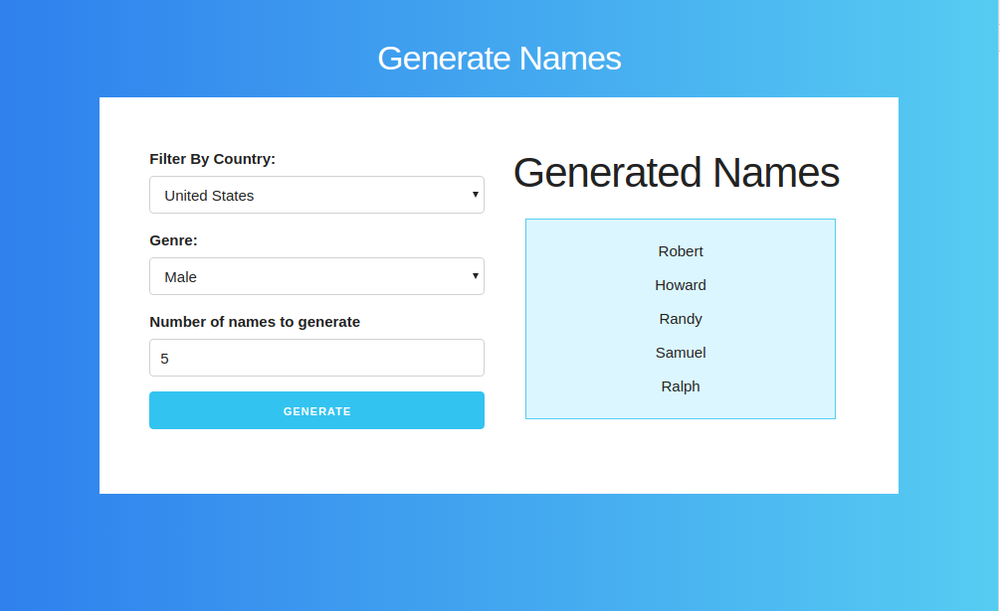

## Name Generator

A simple application that enables you to generate names by country and by gender using JavaScript

## Features
* Consume the data from a REST API

* Send parameters to the REST API based on the infromation provided by the user in the HTML Form.

* Print the results from the [REST API](https://github.com/thm/uinames) with FETCH API ,AJAX y ASYNC/AWAIT

* Use intermediate techniques such as async JavaScript , Arrow Functions & JSON.

## Technology

* HTML
* CSS
* JavaScript
* FETCH API
* REST API
* AJAX
* ES 6